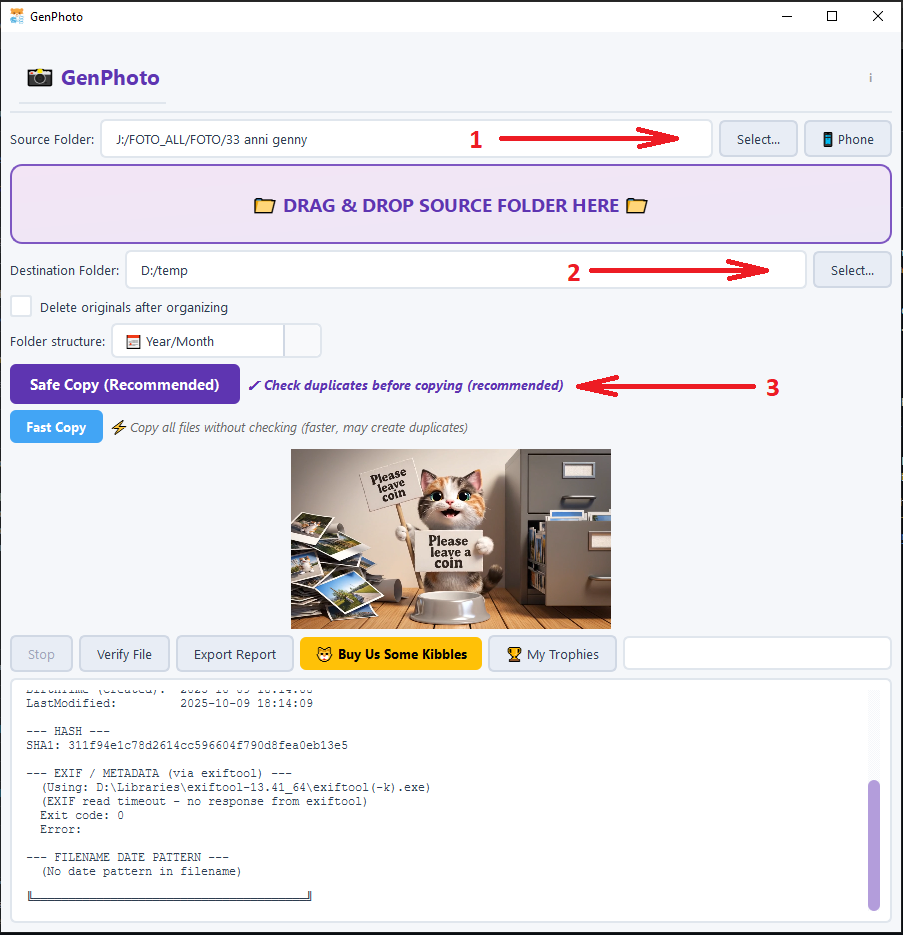

# GenPhoto

GenPhoto (formerly *PhotoHaul*) is a lightweight, free **Windows** application designed to clean up the chaos of photos and videos scattered across old phones, USB sticks, external drives, NAS folders and backups.

It scans your folders, safely detects duplicates and rebuilds a single clean library, organized by **Year → Month**, without altering image quality or metadata.

👉 **Official website & documentation:**  
https://www.gruppogea.net/genphoto/

> **Note:** The project was originally released as *PhotoHaul*.  
> It has been renamed to **GenPhoto** to avoid confusion with unrelated existing projects.

---

## Key Features

- Scan multiple folders, drives and devices in a single run  
- Automatically detect and remove **duplicate** photos safely  
- Clean reorganization into `\Year\Month\` folders  
- Preserve original quality, timestamps and EXIF metadata  
- 100% local processing — **no cloud, no tracking, no account**  
- Simple interface: easy for beginners, efficient for power users  

---

## Download

You can download GenPhoto in two ways:

- **From GitHub Releases (EXE):**  
  https://github.com/ColacioppoGennaro/GenPhoto/releases

- **From the official website (video demo + FAQ):**  
  https://www.gruppogea.net/genphoto/

---

---

## Screenshots

| Main Window | Example Result |
|-------------|----------------|
|  |  |

## Privacy & Safety

- No cloud, no uploads  
- No tracking, analytics or background processes  
- All scans, comparisons and moves happen **locally** on your device  
- Portable and safe to use on offline machines  

---

## Support the Project

GenPhoto is a personal project, completely free and ad-free.  
If it helps you clean up your photo collection, you can support its development:

👉 Donation page: https://www.gruppogea.net/genphoto/

Every contribution helps keep updates and new features coming.

---

## About the Rebranding

This software was previously known as **PhotoHaul**.  
The name has been changed to avoid confusion with other unrelated tools and to build a clear, unique identity for the project.

If you previously used PhotoHaul, **GenPhoto is fully compatible and safe to use**.

---

## License

GenPhoto is **freeware**, but **not open-source**.  
This repository contains only the public documentation, screenshots and release packages.

All rights reserved © 2025 Gennaro Colacioppo.

